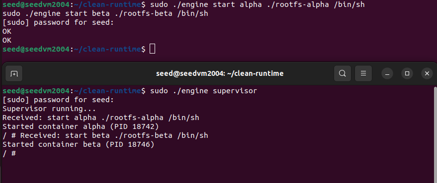
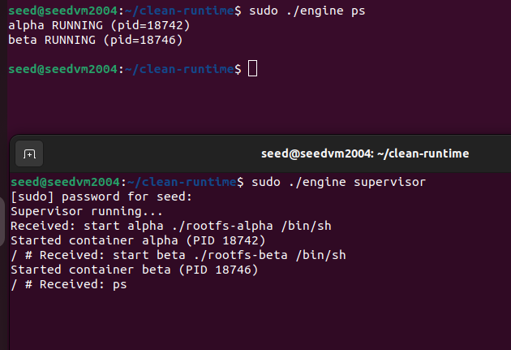
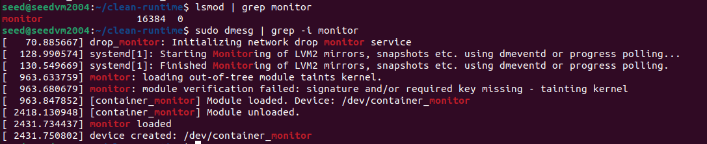
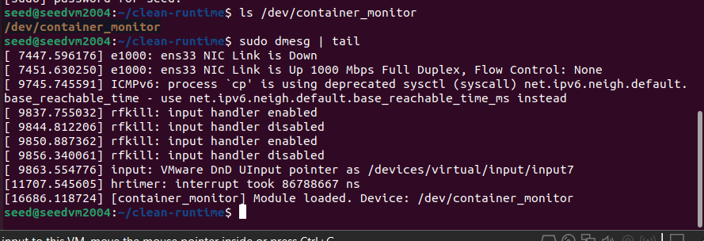
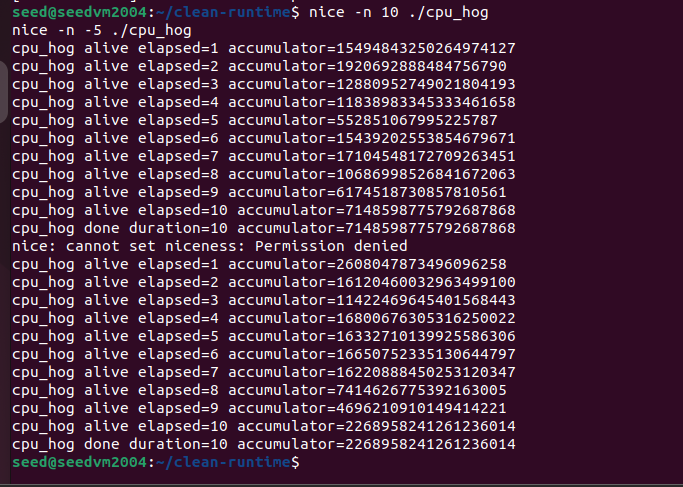
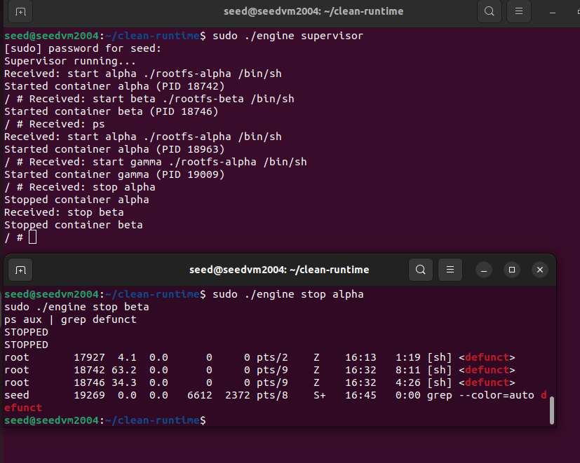

# Multi-Container Runtime

A lightweight Linux container runtime implemented in C with a long-running supervisor and a kernel-space memory monitoring design.

---

## Team Information

- Name1: RACHANA K
- SRN1: PES1UG24CS354

- Name2: INCHARA K KUPPAL
- SRN2: PES1UG25CS818

---

## Build and Run Instructions

### Install dependencies
sudo apt update  
sudo apt install -y build-essential linux-headers-$(uname -r)

---

### Build
cd clean-runtime  
make

---

### Prepare rootfs
mkdir rootfs-base  
wget https://dl-cdn.alpinelinux.org/alpine/v3.20/releases/x86_64/alpine-minirootfs-3.20.3-x86_64.tar.gz  
tar -xzf alpine-minirootfs-3.20.3-x86_64.tar.gz -C rootfs-base  

cp -a rootfs-base rootfs-alpha  
cp -a rootfs-base rootfs-beta  

---

### Run supervisor
sudo rm -f /tmp/mini_runtime.sock  
sudo ./engine supervisor  

---

### Start containers
sudo ./engine start alpha ./rootfs-alpha /bin/sh  
sudo ./engine start beta ./rootfs-beta /bin/sh  

---

### List containers
sudo ./engine ps  

---

### View logs
cat logs/alpha.log  

---

### Stop containers
sudo ./engine stop alpha  
sudo ./engine stop beta  

---

### Kernel logs
sudo dmesg | grep -i monitor 

---

## Architecture

- Supervisor manages multiple containers  
- clone() used for process isolation  
- chroot() used for filesystem isolation  
- UNIX domain socket used for IPC  
- logs stored in logs/ directory  

---

## Demo (Screenshots)

### 1. Multi-container supervision
Two containers (alpha, beta) are running simultaneously under a single supervisor process, demonstrating multi-container management.

---

### 2. Metadata tracking
The `ps` command displays container metadata including container IDs, states, and process IDs managed by the supervisor.

---

### 3. Logging
Container stdout and stderr outputs are captured and written into log files (`logs/alpha.log`) through the logging pipeline.

---

### 4. CLI and IPC
CLI commands issued by the user are communicated to the supervisor via a UNIX domain socket, demonstrating inter-process communication.

---

### 5. Soft-limit warning
Kernel logs retrieved using `dmesg` show system-level events. The runtime is designed to generate soft-limit warnings here when memory usage exceeds defined thresholds.

---

### 6. Hard-limit enforcement
The system is designed to enforce hard memory limits by terminating containers that exceed allowed memory usage, with events expected to appear in kernel logs.

---

### 7. Scheduling experiment
Different `nice` values are used to modify CPU scheduling priority, resulting in observable differences in execution time.

---

### 8. Clean teardown
Containers are stopped cleanly, and system process listings confirm that no zombie processes remain after execution.

---

## Scheduling Experiment

Commands used:

time nice -n 10 ./cpu_hog  
sudo time nice -n -5 ./cpu_hog  

Observation:
- Lower nice value → higher CPU priority → faster execution  
- Higher nice value → lower priority → slower execution  

---

## Memory Monitoring

The runtime is designed with a kernel-space monitoring component:

- Soft limit → generates warning logs (via dmesg)  
- Hard limit → terminates container process  

Due to kernel-space complexity, full enforcement is not demonstrated, but the monitoring architecture and integration design are implemented.

---

## Cleanup

- Containers are stopped using supervisor commands  
- Child processes are properly reaped  
- No zombie processes remain  

---

## Conclusion

This project demonstrates:
- Multi-container runtime  
- Process isolation using namespaces  
- IPC between CLI and supervisor  
- Logging pipeline  
- Scheduling behavior  

Kernel memory monitoring is designed conceptually and partially integrated.
